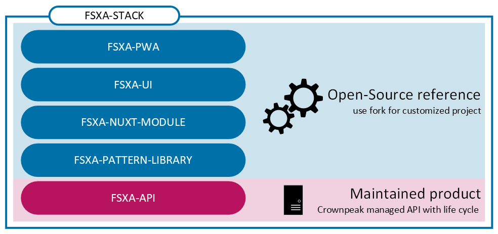

## :exclamation: Important Notice: This Repository is Deprecated

**Important Notice**

This repository has been deprecated and is no longer actively maintained. We recommend you use the [crownpeak-pwa-template](https://github.com/e-Spirit/crownpeak-pwa-template) instead.

# FSXA-UI

### About the FSXA

The FirstSpirit Experience Accelerator (FSXA) is the hybrid solution of a digital
experience platform, combining a headless approach with enterprise capabilities.
The FSXA stack consists of five repositories:

- [FSXA-PWA](https://github.com/e-Spirit/fsxa-pwa)
- [FSXA-UI](https://github.com/e-Spirit/fsxa-ui)/ Component Library
- [FSXA-Nuxt-Module](https://github.com/e-Spirit/fsxa-nuxt-module)
- [FSXA-Pattern-Library](https://github.com/e-Spirit/fsxa-pattern-library)
- [FSXA-API](https://github.com/e-Spirit/fsxa-api)

While the FSXA-API is a maintained product with a life cycle, the FSXA-PWA, FSXA-UI, FSXA-Nuxt-Module and FSXA-Pattern-Library are merely best practices examples how a project could be set up and integrate the FSXA-API.
The latter repositories can be forked to speed up the startup time of a frontend project or to understand how common use cases can be solved in headless projects.
The code itself can therefore also be used as documentation of best practices.

The following image illustrates the product cut:


> **_Attention_**
> Since the reference implementation does not represent a maintained product, we do not guarantee support for its use.

## Project setup

FSXA-UI is really easy to get started with. Make sure to follow the guide below to get a better understanding about some of the decisions behind FSXA-UI and how to use it to kick-off your next project.

You can install FSXA-UI via Yarn or NPM.

```bash
# with npm
npm install fsxa-ui --save

# with yarn
yarn add fsxa-ui
```

<br />

Please make sure that the **main CSS file** is imported from the FSXA UI package.

```typescript
// directly importing the css into your main component
import "fsxa-ui/dist/fsxa-ui.css";
```

```css
/* using node-style package resolution in a CSS file */
@import "fsxa-ui/dist/fsxa-ui.css";
```

```html
<!-- using plain html -->
<link
  href="path/to/node_modules/fsxa-ui/dist/fsxa-ui.css"
  rel="preload"
  as="style"
/>
```

## Usage

Now you can use the components in your project.
In the navigation you will find all available components with a detailed description of all properties and usage examples.

Here you can see how easy the `Button` component can be used.

```typescript
import { Button } from "fsxa-ui";

<Button variant="animated" handleClick={handleClick}>
  This is my Button
</Button>;
```

Please make sure that your component is registered correctly.
<br />

### Compiles and hot-reloads for development

```
npm run serve
```

### Compiles and minifies for production

```
npm run build
```

### Run your unit tests

```
npm run test:unit
```

### Lints and fixes files

```
npm run lint
```

### Customize configuration

See [Configuration Reference](https://cli.vuejs.org/config/).

### Existing CSS-Variables:

- --fsxa-text-highlight-color

## Legal Notices

FSXA-UI is an example solution of [Crownpeak Technology GmbH](http://www.e-spirit.com), Dortmund, Germany.
The FSXA-UI is subject to the Apache-2.0 license.

## Disclaimer

This document is provided for information purposes only.
Crownpeak Technology may change the contents hereof without notice.
This document is not warranted to be error-free, nor subject to any
other warranties or conditions, whether expressed orally or
implied in law, including implied warranties and conditions of
merchantability or fitness for a particular purpose. Crownpeak Technology
specifically disclaims any liability with respect to this document
and no contractual obligations are formed either directly or
indirectly by this document. The technologies, functionality, services,
and processes described herein are subject to change without notice.
